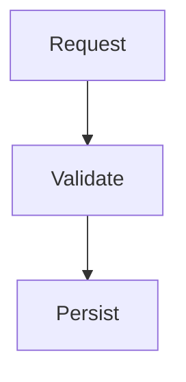

# `markdown-mermaid-validation`

Validates Mermaid diagrams embedded in fenced code blocks in tracked `.md`,
`.markdown`, and `.mdx` files. The rule is opt-in and scans only the configured
repository or project scope.

## Why and when

Use this rule when diagrams are executable documentation: an invalid fence can
silently break rendering or make an architecture description misleading.

## What it catches

It parses Mermaid fences in the three supported Markdown extensions and reports
invalid diagrams or unclosed Mermaid fences at their opening fence line.

## Options

There are no rule-specific options or defaults. Generic `scope`, `include`, and
`exclude` select which supported Markdown files are parsed; they cannot add an
extension beyond `.md`, `.markdown`, and `.mdx`.

## Valid example

The complete `flowchart TD` fence below is valid and its closing delimiter gives
the parser an unambiguous diagram boundary.

The recognized extension set is intentionally fixed to those three Markdown
formats and is matched case-insensitively. `include` and `exclude` narrow both
the findings and the files prepared for parsing, but do not add custom
extensions.

```yaml
rules:
  - rule: markdown-mermaid-validation
    scope: repository
    include: ["**/*.md", "**/*.markdown", "**/*.mdx"]
```

Compliant example:

````markdown

````

Counterexample:

````markdown
```mermaid
flowchart TD
  Request -->
```
````

The counterexample reports the opening fence line. An unclosed Mermaid fence is
reported separately, because its diagram boundary cannot be determined safely.
The language name is case-insensitive, and GFM fences using tildes, longer
delimiters, block quotes, or list containers are validated. Other fenced code
languages are ignored.

Fix: complete the Mermaid statement or close the fence, then run
`no-mistakes check --format json` again.

Suppression caveat: standard `no-mistakes-disable-file`,
`no-mistakes-disable-line`, and `no-mistakes-disable-next-line` directives work,
but suppress the finding at the opening fence line. Prefer fixing the diagram;
use suppression only for intentionally invalid syntax shown as documentation.

Validation uses the exact Merman parser version pinned by no-mistakes. Merman
targets Mermaid syntax compatibility, but newly added MermaidJS syntax may not
be accepted until the corresponding Merman release is available.

For in-memory content, the async Node API exposes
`validateMermaidMarkdown({ content, file? })` and returns structured diagnostics
without requiring a temporary Markdown file. Pass an `.mdx` file name to enable
full recovery of Markdown fences nested directly inside MDX JSX blocks. When
`file` is omitted, clear JSX component blocks are detected automatically while
standard Markdown HTML blocks retain CommonMark semantics.

## Related rules

[`markdown-structure-budget`](markdown-structure-budget.md) controls diagram
count in oversized documents; [`markdown-reachability`](markdown-reachability.md)
keeps the document discoverable.
