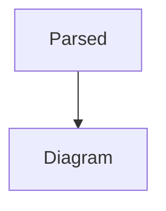

export const hidden =
  // The assignment continues past this comment.
  `
```mermaid
flowchart TD
  Hidden --> Broken -->
```
  `;

export const completed = hidden /* This comment does not continue the statement. */

export default
  String.raw`
```mermaid
flowchart TD
  HiddenDefault --> Broken -->
```
  `;

Ordinary prose punctuation must not start ESM state:
export:


