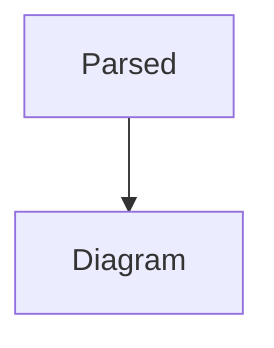

<DiagramCard>
{
  `The illustrative diagram is separated by an intentional blank line.

~~~mermaid
this is illustrative text, not a Mermaid diagram
~~~
  `
}

`This literal { brace must not begin an MDX expression in the fallback scanner.`

{/[{]/.test(value)}

</DiagramCard>
